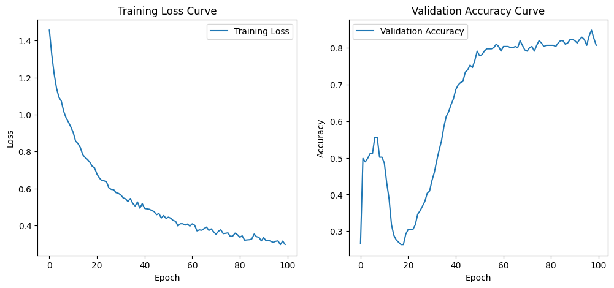

# Project for Machine Learning course

## Problem
To predict which season of the year (winter, spring, summer, autumn) corresponds to a 24-hour record of power consumption and production of a *european* country.

## Dataset
Open Power System Data dataset. 

Dataset used is a subset of the Open Power System Data, which contains various hourly power
related measurements (e.g., consumption, wind generation, solar capacity) across EU 
countries from 2015 to approximately 2020.

## EDA

These 3 columns were chosen because they are the most descriptive of the season. 

Observations:
1. Wind generation is almost constant throughout 1 season
2. Wind generation differs significantly from season to season
3. Solar electricity is generated between 4 am and 6 pm and is very different for each season

## Proposed solutions
We propose Multi-layer Perceptron (MLP), 1D and 2D convolutional neural networks (CNN) as our solutions to the problem. We think they are particularly well-suited for this task for the following reasons:

* MLP performs well when the data is well-structured because it directly learns from raw features without relying on spacial relationships
* 1D CNN is designed to capture patterns in sequential data such as time-series (which we have in this task)
* 2D CNN is likely going to perform well, but worse than the previous 2 algorithms because of small 'image' size (24 pixels while it usually needs 1000+). It's included mainly for comparison

## Results
We have chosen Denmark for testing the models. The results on a random launch are as follows:

* MLP accuracy: 0.8349
* 1D CNN accuracy: 0.8540
* 2D CNN accuracy: 0.8540

The accuracy is quite high for all methods with 1D and 2D CNN being the best. Furthermore, accuracy for 1D CNN can be improved to 0.9+ if StandardScaler is used instead of MinMaxScaler. We used MinMaxScaler because it leads to significantly better results for 2D CNN with GAF transformation. 1D CNN being the best (with StandardScaler) is expected since it's specifically designed to work with time-series. MLP is slightly worse than the other 2 models because it doesn't capture more distant patterns.

Below confusion matrices and training graphs are presented.
### MLP

### 1D CNN

### 2D CNN

## How to use
First clone the repository and install requirements.txt.

Then enter desired values for n number of days to input.csv and launch predict.py. Values should correspond to Denmark as it was used for training, for other countries training dataset needs to be changed in main.ipynb.

## Reflection
During this project we have recieved hands on experience in machine learning. A lot (90%) of the expertise needed to implement this project wasn't covered in the course, so we had to put significant effort into understanding new material ourselves. Luckily, it was fun and engaging. As a result, we have learned in-depth how MLPs & CNNs work in theory and how to implement them in practice using pytorch. Besides that we have learned a lot of smaller ML aspects, e.g. how to perform exploratory data analysis (EDA) and ensure no data leakage.
